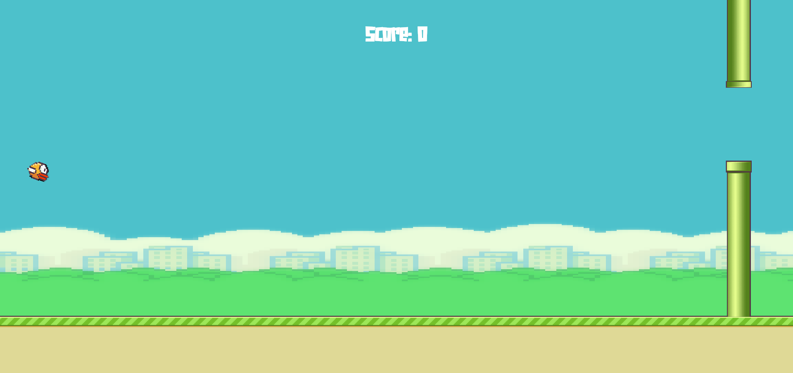
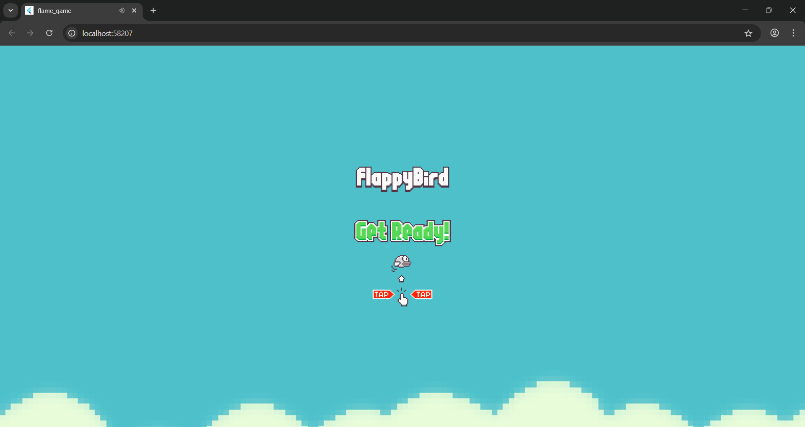
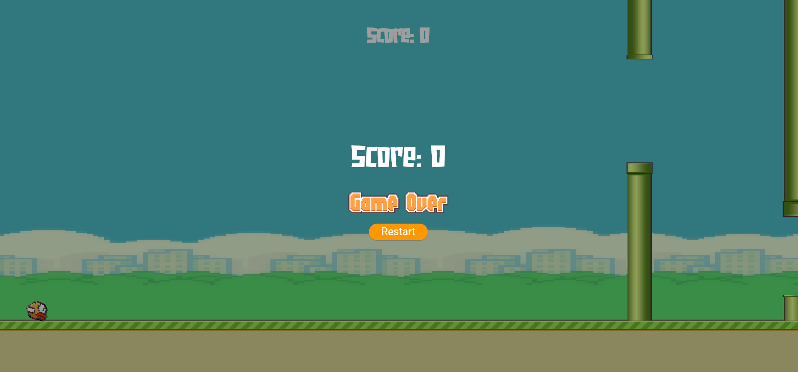

# 🐦 Flappy Bird — Flutter + Flame Engine

A visually engaging, cross-platform Flappy Bird clone built with the [Flame](https://flame-engine.org/) game engine for Flutter.



---

## 🚀 Features
- Smooth, physics-based gameplay
- Parallax scrolling backgrounds
- Animated bird with up/mid/down flaps
- Procedurally generated pipes
- Sound effects for jumps, collisions, and points
- Game over and restart mechanics
- Responsive for mobile, desktop, and web

---

## 🛠️ Getting Started

1. **Clone the repository:**
   ```sh
   git clone https://github.com/itsahmadawais/flappy_bird_flame.git
   cd flappy_bird_flame
   ```
2. **Install dependencies:**
   ```sh
   flutter pub get
   ```
3. **Run the game:**
   ```sh
   flutter run
   ```
   Or run on web:
   ```sh
   flutter run -d chrome
   ```

---

## 📁 Assets
- All game assets are in the `assets/` folder (images, audio, fonts)
- Update `pubspec.yaml` if you add new assets

---

## 📸 Screenshots
| Menu | Gameplay | Game Over |
|------|----------|-----------|
|  |  |  |

---

## 📚 Learn More
- [Flame Engine Documentation](https://docs.flame-engine.org/)
- [Flutter Documentation](https://docs.flutter.dev/)
- [Flappy Bird on Wikipedia](https://en.wikipedia.org/wiki/Flappy_Bird)

---

## ✨ Credits
- Game developed by Awais Ahmad
- Powered by [Flame](https://flame-engine.org/) & [Flutter](https://flutter.dev/)
- Inspired by the original Flappy Bird

---

## 📝 License
This project is licensed under the MIT License.
